# 纸上的回声 · 游戏逻辑与功能板块预览

> 对齐当前飞行口径（2026-08-23）：寻找中只巡航等待，无跟飞、无躲障；找到后用 `searchNote` 下拉落地。  
> 拼碎片（`compose`）已删除：`43bcbd7`「拿掉拼碎片，倾听写完直接折」。  
> 本文只描述现状，不改玩法口味。  
> 聊天页手感与「AI 有没有进眼睛」见 [`docs/previews/encounter-agent.md`](./previews/encounter-agent.md)。

---

## 0. 一晚上在干什么

玩家不先点「我很焦虑」。用手把靠近自己的情绪拖近中心，写下今晚那句说不出口的话，这张纸直接拿去折成飞机，掷向世界某处。对面是一个深夜没睡的普通人：只说自己今晚的具体事，不安慰、不分析、不替你下结论。桌上用自己的真细节换对方故事的下一层。两三句来回之后，对方折一封回信过来。信柜留下这句话，世界档案多记一件事。

| 命题题眼 | 这局里怎么落地 |
|---|---|
| **识别** | 8 个情绪 token 离中心越近，越算「认领」。系统算出 `Fingerprint`，不把标签说给对方听。 |
| **回应** | 回声只讲自己的平行经历。回应 = 被看见，不是被安慰。 |
| **推动一次更好的沟通** | 玩家必须先交出自己的一句（轨道写句 → 对话里再交真细节），才能换到对方故事的下一层。 |

关键动作仍是拖 / 折 / 拉 / 松开。轨道写完后也可以点「带着走」；相遇桌上可以点纸条。`prefers-reduced-motion` 回退为 tap / Enter。

---

## 1. 主循环（玩家走的路）

HUD 上 6 个点 = `JOURNEY`。`title` 是进门，`archive` 是出口，都不算步。`compose` 已从类型和壳子里删掉。`mirror` 类型还在，主流程不再经过。

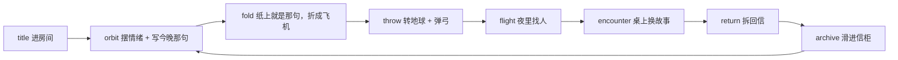

可回退：`orbit → title`，`fold → orbit`，`throw → fold`。飞出去之后不能回头。信柜可从标题或 HUD 抽屉进入，再回到离开前的阶段。

```
玩家手势                         store 动作                    产出
────────                         ────────                     ────
标题卡下拉                       startNew()                   进房间，重置一局
情绪拖近 + 写下 ≥4 字 + 带着走   commitListen(text)           纸上就是那句，进 fold
对角折两次 + 飞机上送            goThrow()                    飞机到窗边
转地球 + 弹弓松开                launch(power)                进 flight，后台 runMatch
找到人后下拉                     arrive()                     进 encounter
纸条点/拖到桌 / 手写             reply(text)                  runTurn；第 3 轮 runSeal
回信下拉拆开，再下拉归档         saveReturn()                 Journey + archival
信柜抽空白                       startNew()                   新的一晚
```

---

## 2. 机制层（玩家看不见、决定手感）

### 2.1 情绪指纹

8 个情绪围着「你」转：郁闷、委屈、焦虑、疲惫、孤单、愤怒、平静、想被看见。

- 离中心越近，`closeness` 越高。环半径 `28–46`，中心 `{x:50, y:48}`。
- `ownedOf(fp, 0.42)`：靠近阈值以上的才算认领；一个都没有就取最靠近的一个。
- 认领结果喂给 replies 兜底句、match 时的故事排序。chips 池还在算，但玩家不再拼进纸。

玩家看见的是生物脸和「今晚的画像」，不是百分比。

### 2.2 信就是今晚那句

`letterFromChips(chips, extra, mirror)`：碎片和加写都空时，直接用轨道上写下的那句（`selectedMirror`）。再空，才用默认句「今晚我想把一句说不出口的话折起来。」那句最多 56 字，也是 match 链看到的 `mirror`。

### 2.3 回声从哪来

不是玩家点选故事卡。飞机掷出后，match 链去找一个也说过类似话的人：

1. 库优先：12 张手写 Story + `collect.ts` 预采集改写稿，先占满 5 条开口。
2. 现场可短预算爬公开页补空位，失败不影响开口。
3. 无 key / 超时 / 校验不过 → `fallbackEcho`：按情绪重叠 + 区域，从本地故事卡取一个。

回声身份：`EchoPerson{name, city, felt, greeting, replies, returnLetter, source:"live"|"archive"}`。`felt` 必须是人话短句，禁止 `anxious,tired` 这种标签串。

### 2.4 故事交换（对话的真正玩法）

影子有自己的三层故事。玩家用「新的、具体的、自己的真细节」一层层换。桌上三颗点只表示「显影」到哪，不写层号。

| 层 | 影子这一句讲什么 | 玩家怎么换到下一层 |
|---|---|---|
| 第一层 | 发生了什么 | 开场影子先交出 |
| 第二层 | 当时落在身上的感觉 | 交出新的具体自己的事 |
| 第三层 | 后来改了什么 | 再交一层真细节 |

判定三要素缺一不可：新的（不复读）、具体的（时间 / 地点 / 动作 / 物件）、自己的（有「我」）。连续 2 轮没交新细节，影子只露出下一层半个开头；第 3 轮仍没有，软解锁，不罚、不弹失败。

### 2.5 记忆三层

| 层 | 活在哪 | 容量 | 干什么 |
|---|---|---|---|
| core | 本轮 prompt 常驻块 | persona + human | 「你是谁」和「玩家以前说过」 |
| recall | 当晚对话，不落盘 | 几句 | 桌上那叠纸 |
| archival | `paper-echo-memory-v2` | ≤48 条 | 跨夜信柜，Jaccard 检索 |
| journeys | `paper-echo-v1` | ≤24 局 | 整晚记录，信柜列表 |

写入发生在 `saveReturn`：从信 / 玩家台词抽事实，Jaccard ≥0.48 合并。

### 2.6 Agent 三链（流程由代码决定）

游戏层不读 LLM。三条 Server Function，每条 = 确定性检索 → 单工具短命 Pi Agent → 确定性校验。

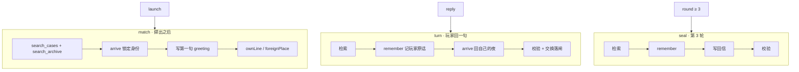

回声铁律（常驻）：写事不写状态；一两句像微信；零剧场腔；不安慰；不把玩家旧事改成「我……」；不串城；不把层号说出口。

超时：match 22s / turn 12s / seal 14s。无 key、步失败、超时，三层都能走完一晚。

### 2.7 手势原语

| 原语 | 用在哪 | 提交条件 |
|---|---|---|
| `PullCommit` | 进房间、带着走、落到桌、抽空白 | 拉过阈值再松手；轨道写完也可点「带着走」 |
| `useWellDrag` | 建议纸条上桌 | 拖进 well，或点一下 |
| 对角折 | 折飞机 | 拉力 `v > 0.42` 折住 |
| 上送 | 飞机出窗 | 上移 `> 40` |
| 弹弓 | 掷出 | `power ≥ 0.22` 释放，拉满 `0.86` |
| 回信下拉 | 拆开 / 归档 | `y > 28` 拆开，`y > 108` 进抽屉 |

同一个 `layoutId="echo-craft"`：纸 → 飞机 → 回信，是一件东西在变形。

---

## 3. 功能板块预览

静帧在 `docs/previews/`，由 `scripts/preview-modules.mjs` 注入 store 拍下（390×844）。throw / flight 跳过入场弹簧。重拍：`npm run dev` 之后 `node scripts/preview-modules.mjs`。聊天页另拍：`node scripts/preview-encounter.mjs`。

### 3.1 title · 进房间

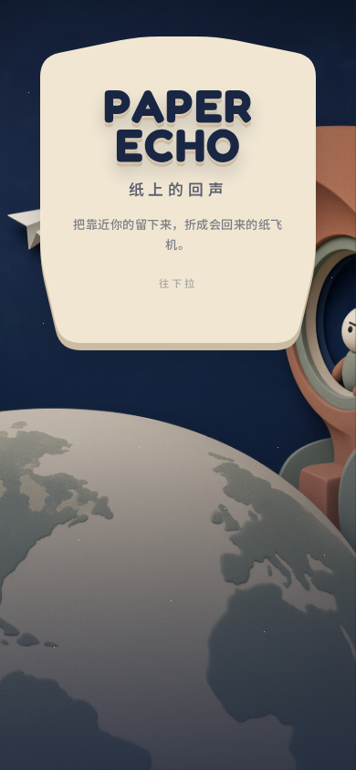

| | |
|---|---|
| **玩家看见** | 一张纸卡。`PAPER` / `ECHO` 进场错开弹出。副文「未说出口的也值得回应。」有过局则底部多一个「信柜 N」。 |
| **手** | 整张卡往下拉，过 56 松开。有信柜时，抽屉另拉，过 36。 |
| **产出** | `unlockAudio` + 底噪；`startNew()` 重置一局，进 `orbit`。标题保持原景；拆开后再把镜头推近。 |
| **场景** | `title.jpg`，夜间。 |

### 3.2 orbit · 摆情绪 + 写下今晚那句

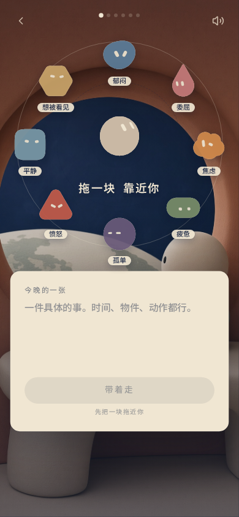

| | |
|---|---|
| **玩家看见** | 环形场，中心「你」，周围 8 张情绪脸。一张纸，placeholder「一件具体的事。」写满 4 字后出现「今晚的画像」和「带着走」。 |
| **手** | 把靠近自己的 token 拖进内环。写完后点「带着走」，或把纸往下拉。 |
| **门槛** | 至少认领 1 个情绪（closeness ≥ 0.42）**并且**今晚那句 ≥ 4 字，最多 56 字。 |
| **产出** | `commitListen`：指纹、`selectedMirror` = 那句原文，**直接进 `fold`**。不再经过拼碎片。 |
| **场景** | 房间静帧 / `room.mp4`，镜头已推近。 |
| **可回退** | 回标题。 |

### 3.3 fold · 纸上就是那句，折成飞机

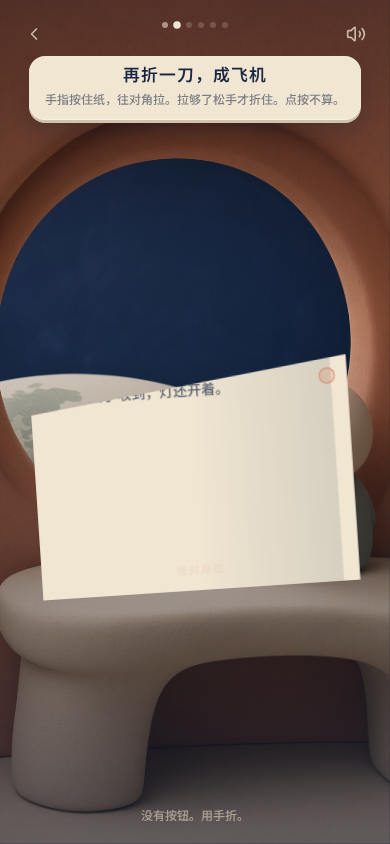

| | |
|---|---|
| **玩家看见** | 一张还能读到字的纸，字就是轨道上写下的今晚那句。两次折完变成飞机。 |
| **手** | 对角拉，`v > 0.42` 折住，折两次。第三次把飞机往上送，位移 `> 40`。 |
| **产出** | `goThrow()`。 |
| **可回退** | 回轨道。 |

### 3.4 throw · 转地球 + 弹弓

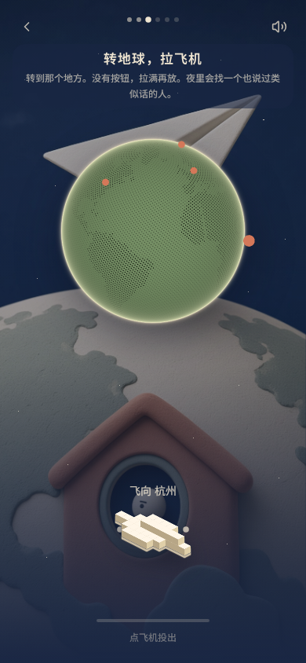

| | |
|---|---|
| **玩家看见** | 夜空。可转的地球。飞机从窗落进橡皮筋。面向哪个区域，文案跟到哪座城。 |
| **手** | 转地球选区；拉飞机，`power ≥ 0.22` 松手飞出。 |
| **产出** | `launch(power)` → 立刻进 `flight`，后台 22s 内跑 match。不选区则默认东亚，或用最后面向的区域。 |
| **可回退** | 回折纸。发出去就不能回。 |

6 区：东亚·杭州、美洲·芝加哥、欧洲·里斯本、非洲·内罗毕、南半球·奥克兰、极夜·特罗姆瑟。区域是 match 加分，不是硬过滤。

### 3.5 flight · 夜里找人

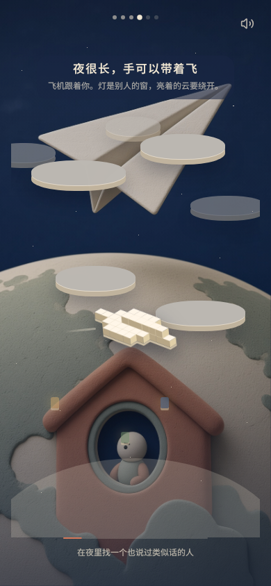

| | |
|---|---|
| **玩家看见** | 飞机自己在云里巡航。寻找中文案是 `searchNote`：「寻找世另我ing」，静态一行，没有首页字标弹出。找到后：「到了 {城}，{名} 读完了你的信」。没有跟飞、躲障、窗光。 |
| **手** | 寻找中无操作。找到后下拉，过 48。 |
| **产出** | `arrive()` → `encounter`。recall 里已有对方第一句。失败则本地故事卡，文案改线路不稳兜底。 |

### 3.6 encounter · 桌上换故事

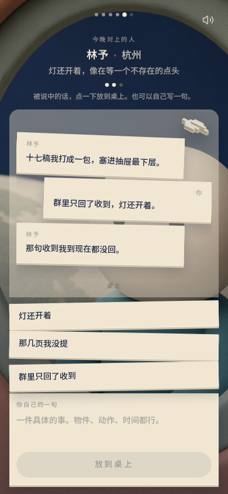

| | |
|---|---|
| **玩家看见** | 「今晚对上的人 {名} · {城}」，名字从等待条同槽长出。三颗点表示故事显影到哪。桌上叠着当晚对话。听完后底下出现纸条，加一个「你自己的一句」。 |
| **手** | 被说中的话点一下或拖到桌上。也可以自己写（≤72 字）。 |
| **门槛** | `waitingEcho` 时不能连发。满 3 轮封信。 |
| **产出** | `round < 3`：`runTurn` 12s。`round ≥ 3`：`runSeal` 14s，进 `return`。具体细节才换下一张；层号不出现。 |
| **可回退** | 不能。 |
| **谁在说话** | 交互是真的。2026-08-23 真跑时模型钥匙失效，桌上字是本地故事卡；三张纸条始终是情绪池，不是模型句。详见 [encounter-agent.md](./previews/encounter-agent.md)。 |

### 3.7 return · 拆回信

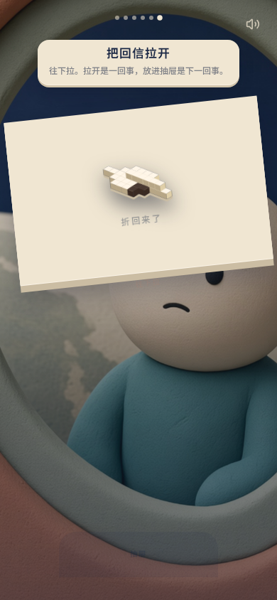

| | |
|---|---|
| **玩家看见** | 飞机落到桌上，变成一封信。下拉先拆开读 `returnLetter`，再往下，信被抽屉吞进去。 |
| **手** | `y > 28` 拆开，`y > 108` 归档。 |
| **产出** | `buildJourney` → journeys 最多 24；事实写入 archival。进 `archive`。 |
| **可回退** | 不能。归档前刷新会丢这一局。 |

### 3.8 archive · 信柜

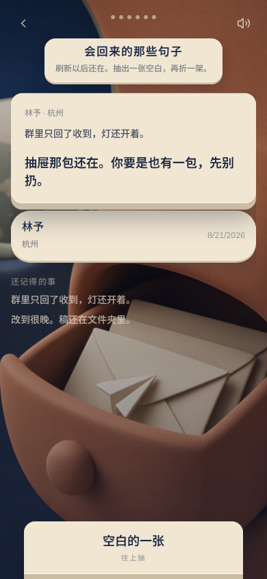

| | |
|---|---|
| **玩家看见** | 「会回来的那些句子」。点开一封：自己的信 + 对方回信。下面最多 6 条「还记得的事」。底部「空白的一张」。 |
| **手** | 点开已有的信。空白往上抽，过 36，开始新的一晚。 |
| **产出** | `startNew()` 回 `orbit`。 |

---

## 4. 系统板块预览

### 4.1 回声系统面板（按 J）

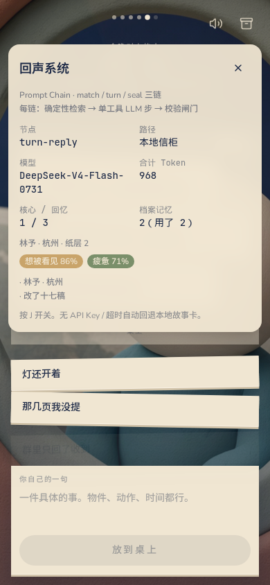

给评委看的透明盒。展示：当前链节点、live / 本地信柜、token、认领情绪百分比、persona、检索 hits、当晚 recall、档案条数、交换层（内部）。模型步没吐字时路径应是「本地信柜」，不再空盖「实时链」。`09-judge.png` 仍是旧的注入假 meter；真话术静帧见 `14-encounter-judge.png`。

### 4.2 世界档案与采集

- 手写核心池：12 人，覆盖 6 区。
- 预采集改写稿编进 `src/game/collect.ts`，运行时零网络也能开口。
- `npm run collect` 扩库：原文只落本地 `corpus/`。

### 4.3 离线完整可走

没有 MiniMax / AI PING key，或任何一链超时，玩家仍能从标题走到信柜。

---

## 5. 状态机速查

```
Phase = title | orbit | mirror | fold | throw | flight | encounter | return | archive
JOURNEY = orbit fold throw flight encounter return
CAN_BACK = orbit fold throw archive
```

`compose` 已删除。`mirror` 组件还在，`pickMirror` 已空实现。`addChip` / `letterChips` 还留在 store 里，玩家界面不再用。

关键字段（一局）：

```
tokens[]          8 颗位置
fingerprint[]     亲疏排序
selectedMirror    今晚亲笔那句（折进飞机的正文）
echo              对上的人（起飞后才有）
recall[]          当晚对话
exchange          {unlocked:1|2|3, silentTurns}
round             0..3
journeys[]        信柜
archival[]        还记得的事
```

---

## 6. 和旧文档 / 上一版预览差在哪

| 上一版预览（停在 `02b631d`） | 现在的 main（`0b678da`） |
|---|---|
| `orbit → compose → fold` | `orbit → fold`，纸上就是今晚那句 |
| 碎片拖进纸，最多 5 条 | `ComposePhase.tsx` 已删 |
| HUD 7 个点 | HUD 6 个点 |
| 相遇只能拖建议卡 | 点纸条、自己写、或拖到桌上 |
| 「手是唯一提交，点一下不算」全场 | 轨道「带着走」和桌上纸条允许点 |

以本文 + `src/game/store.ts` / `types.ts` / `echo-spec.md` 为准。`docs/PRD.md` 的 phase 表是更早的快照。

---

## 7. 还没拍板、本文不发明

1. **throw 选区的意义还偏弱**。
2. **return 关页即丢**。
3. **match / turn 的部分 AI 产出**游戏层还没全吃进去（链上 suggestions / facts 仍被丢掉）。有效钥匙到位后，用 `scripts/probe-encounter.mts` 再对一次桌上句子。
4. **store 里残留的 chips / addChip**：界面已不用，是否清掉另说。
5. **命题张力**还没当作对外口径定稿。
