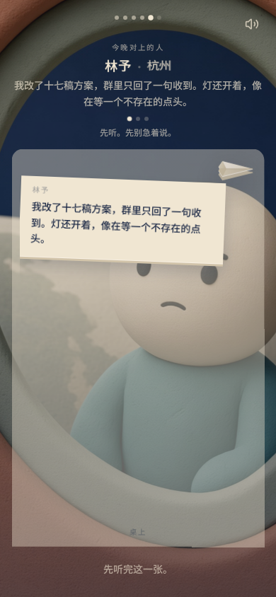
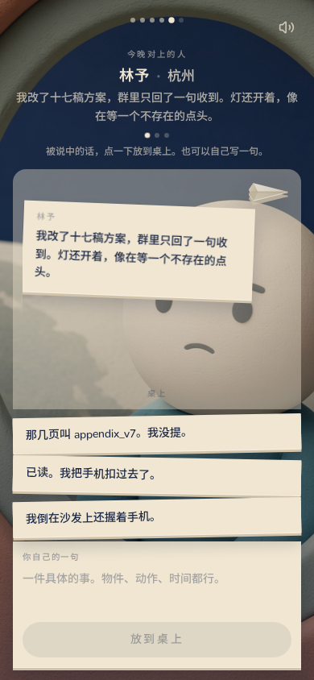
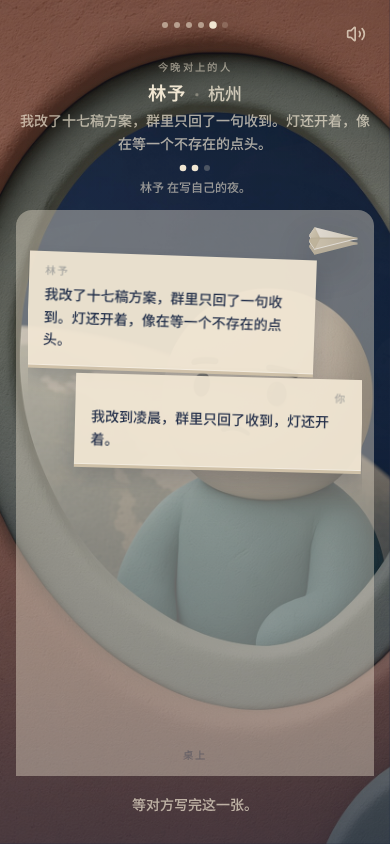
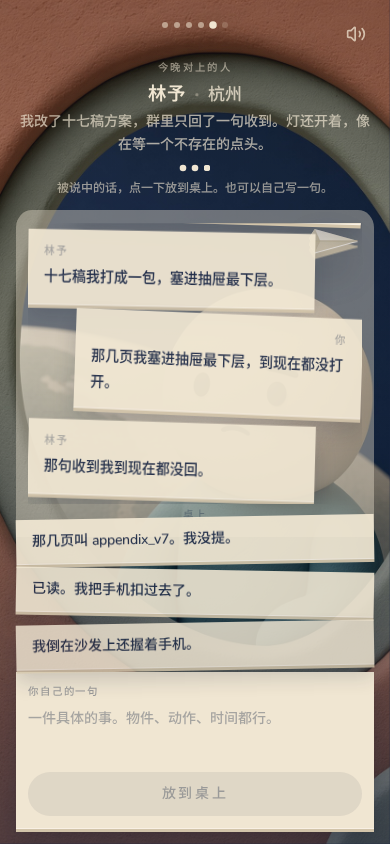
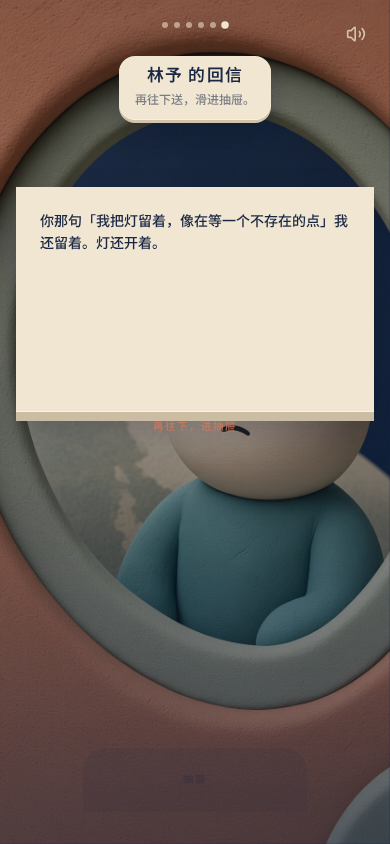
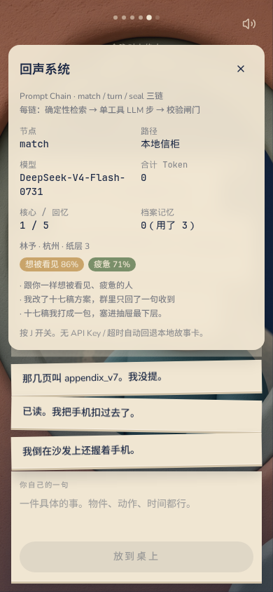
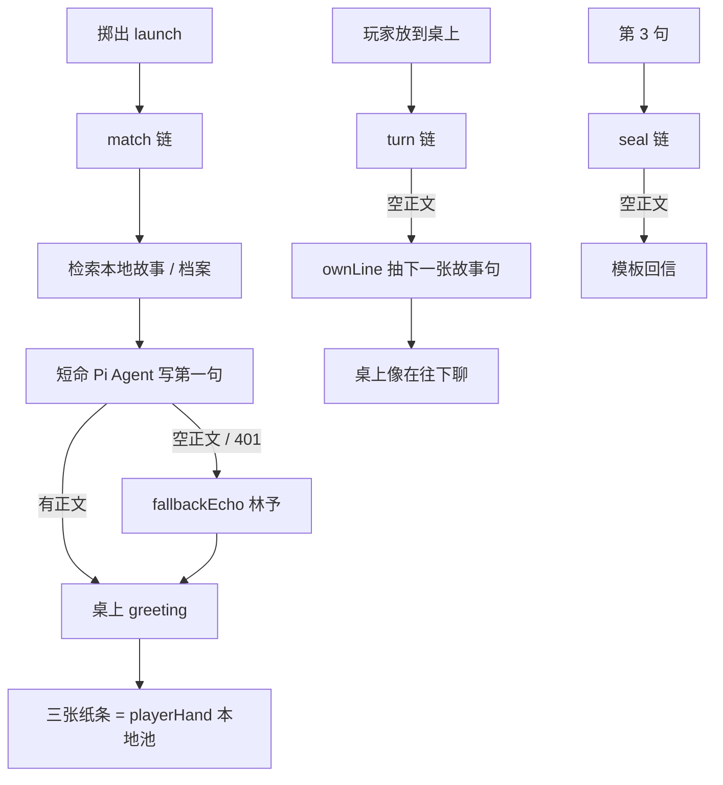

# 聊天页 × Agent：这一晚能不能成立

> 2026-08-23 真跑。口味未改。桌上交互按现码拍静帧；AI 是否进了玩家眼睛，按链上实测写，不编。

信：`群里只回了收到，灯还开着。`  
指纹：想被看见 86% · 疲惫 71% · 区东亚。  
模型：`DeepSeek-V4-Flash-0731` @ AI PING。当时那把钥匙返回 `apikey not found`。

---

## 结论（先看这个）

| | 事实 | 意味着什么 |
|---|---|---|
| **手在桌上怎么玩** | 先听 → 点/拖纸条或手写 → 等回条 → 第三句封信 | 交互闭环是完整的，离线也能走完 |
| **AI 有没有接到游戏里** | 三链会跑；检索会查本地故事；有 key 就去打模型 | **管线在。** 钥匙失效时模型步是空的 |
| **玩家眼里那句是谁写的** | 开场、回合、回信都是 **林予这张手写故事卡** | 看起来像在对话，字是库里的 |
| **按 J 以前会不会骗人** | 模型空正文仍盖「实时链」 | 已改：没吐字就标「本地信柜」 |
| **三颗点会不会亮** | store 先把当前句推进 recall，闸门当成复读 | 已改：闸门只看此前的玩家句 |

现在还缺一把有效的 `AI_PING_API_KEY`。没有它，Agent 效果成立不了——成立的是「本地故事卡 + 桌上换句」。

---

## 1. 手在桌上怎么玩

静帧由 `scripts/preview-encounter.mjs` 注入当晚会看到的句子（390×844）。

### 先听

对方第一句从等待条同槽长出来。640ms 内底下没有纸条，提示「先听。先别急着说。」`prefers-reduced-motion` 会跳过这拍。

### 能说

三张建议纸条 +「你自己的一句」。点一下或拖到桌上。手写 ≥4 字才能放；不够具体会提示「再落到一件具体的事上」。

这三张纸条来自情绪 reply 池（`playerHand`），**不是模型写的**。这一晚是：

- 那几页叫 appendix_v7。我没提。
- 已读。我把手机扣过去了。
- 我倒在沙发上还握着手机。

### 等回条

`waitingEcho` 时不能连发。头上写「{名} 在写自己的夜。」

### 两三句之后

第 3 次放到桌上走 seal，进拆回信。三颗点只表示故事显影到哪，不写层号。

### 回信

这一晚的回信是模板兜底：`你那句「我把灯留着，像在等一个不存在的点」我还留着。灯还开着。`

### 按 J

节点 `match`，路径 **本地信柜**，模型名还在，合计 token 0。检索 hits 是故事库里的相似人。

---

## 2. AI 进没进玩家眼睛

### 真跑对照（同一把失效的钥匙）

| 步 | 链说自己 | 吐出的字 | 桌上实际看到 |
|---|---|---|---|
| match | 曾盖 live；现为 archive | 空 | 林予 · 杭州 ·「我改了十七稿方案…」= 故事卡 s1 |
| turn 1 | 空正文 | 空 / 复读开场 | `ownLine` 换成「十七稿我打成一包，塞进抽屉最下层。」 |
| turn 2 | 空正文 | 空 / 复读开场 | 「那句收到我到现在都没回。」 |
| seal | 空正文 | 空 | 模板：点出玩家最后一句前 16 字 |
| 建议纸条 | 链上 `suggestions: []` | — | 情绪池三张，见上 |

换一封库外的信（`洗衣机停在中途，袜子还挂在门把手上。` 飞欧洲）仍然落到 **Mara · Lisbon** 的开场句。有钥匙、检索在跑，模型步不写字，身份就是本地最佳匹配。

Pi Agent 最后一条 assistant：`content: []`，`errorMessage: "401 status code"`。直连 `POST https://aiping.cn/api/v1/chat/completions` 同一把钥匙：`{"code":401,"msg":"apikey not found"}`。

### 会进桌上 / 进了又被丢掉

| 产出 | 进不进眼睛 |
|---|---|
| `name / city / felt / greeting` | 进。无模型字时等于本地故事卡 |
| turn `spoken` | 进。空了就被 `ownLine` 换成 `echo.replies` 下一句 |
| seal `returnLetter` | 进。空了走模板 |
| 链上 `suggestions` | **丢掉。** 桌上永远 `playerHand` |
| `facts` / remember | **丢掉。** 要等 `saveReturn` 从玩家台词抽 |

---

## 3. 这一晚上的两处接线（已改，未改玩法口味）

1. **交换闸把自己当复读。** `store.reply` 先把当前句推进 `recall`，`advanceExchange` 的 `priorPlayer` 又原样拿来，`isNewPersonalDetail` 看到自己，永远不算新细节。点不会因「交了真事」往前走，只能靠连续 3 轮软解锁。闸门改为使用已有的 `recallWithoutCurrent`。改完再跑：turn1 `unlocked: 2`，turn2 `unlocked: 3`。
2. **空正文还盖「实时链」。** 模型 401 / 超时时 `meter.via` 仍是 live。现改为：这一步没有 assistant 正文，就标 archive。同一把失效钥匙再跑，三链都是 `via: archive`。

没改：纸条仍用本地池、remember 仍不写进 archival、对话规则仍是「写事不写状态 / 不安慰」。

---

## 4. 要让「AI 能力真的在游戏里」还差什么

1. **一把能用的 `AI_PING_API_KEY`**（写进本地 `.env`，不要进 git）。用 `npx -y tsx scripts/probe-encounter.mts` 看 `match.via` 是否变成 `live`，且 `greeting` 不再等于本地开场句。
2. 再决定要不要把链上的 `suggestions` 接到桌上（现在是假选项、真手写）。
3. 再决定 remember 要不要当场留下，还是只在拆回信时写档案。

复拍静帧：`npm run dev` 之后 `node scripts/preview-encounter.mjs`。
